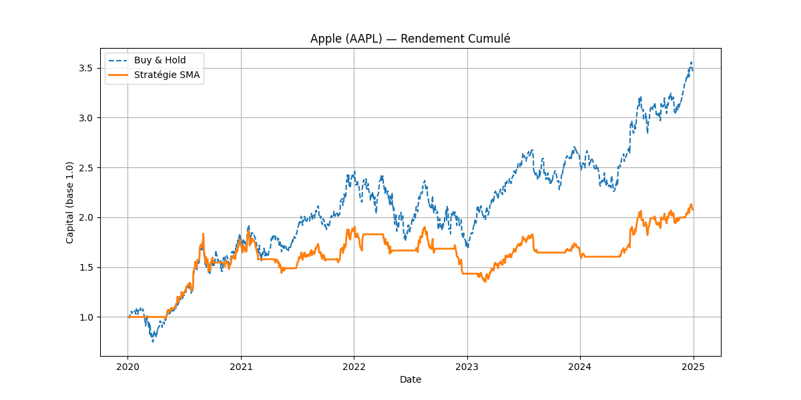
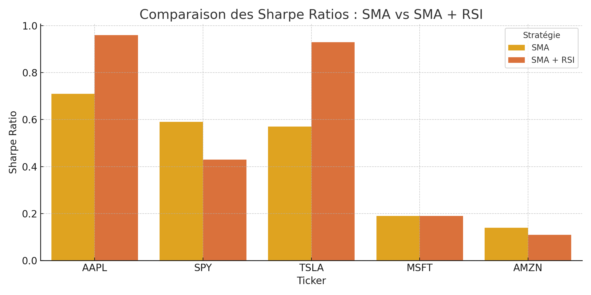

# Trading Strategy Backtest

Un projet de backtesting d'une stratégie de croisement de moyennes mobiles (SMA) sur plusieurs actifs boursiers, avec analyse complète des performances (rendement, volatilité, Sharpe ratio, drawdown).

---

## Objectif du projet

- Implémenter une stratégie simple : SMA(20) croise SMA(50)
- La tester sur différents actifs (AAPL, TSLA, SPY, AMZN, MSFT)
- Comparer les performances : rendement annualisé, volatilité, Sharpe ratio, drawdown
- Visualiser et analyser les résultats comme le ferait un desk de trading

---

## Technologies utilisées

- Python 3.x
- `pandas`, `numpy` — manipulation de données
- `yfinance` — récupération de données boursières
- `matplotlib` — visualisation des résultats
- `Git` et GitHub — versionning

---

## Exemple de résultat SMA

| Ticker | Rendement annualisé (%) | Volatilité (%) | Sharpe Ratio | Max Drawdown (%) |
|--------|--------------------------|----------------|---------------|------------------|
| AAPL   | 15.76                    | 20.64          | 0.71          | -29.09           |
| SPY    | 8.39                     | 12.63          | 0.59          | -28.89           |
| TSLA   | 28.37                    | 47.98          | 0.57          | -56.61           |
| MSFT   | 4.69                     | 19.58          | 0.19          | -43.50           |
| AMZN   | 4.43                     | 25.16          | 0.14          | -48.39           |

### Visualisation de la stratégie sur AAPL



---

## Exemple de résultat SMA + RSI

=== COMPARAISON DES ACTIFS ===
Ticker  Rendement annualisé (%)  Volatilité annualisée (%)  Sharpe Ratio  Max Drawdown (%)
  AAPL                    17.25                      16.95          0.96            -26.52
  TSLA                    35.91                      37.51          0.93            -37.81
   SPY                     5.07                       9.45          0.43            -15.48
  MSFT                     3.92                      15.10          0.19            -36.29
  AMZN                     3.23                      20.13          0.11            -32.26

### Comparaison visuelle : SMA vs SMA + RSI

Ces graphiques comparent les performances entre la stratégie de base (SMA) et la version améliorée (SMA + RSI).

#### Sharpe Ratio


#### Max Drawdown


---

## 📂 Structure du projet

```
trading-strategy-backtest/
├── main.py             # Exécute le backtest sur plusieurs actifs
├── strategy.py         # Stratégie SMA crossover
├── backtest.py         # Moteur de calcul des performances
├── metrics.py          # Calcul des métriques : Sharpe, drawdown, etc.
├── requirements.txt    # Bibliothèques nécessaires
├── figures/            # Graphiques éventuels
└── README.md
```

## Lancer le projet (tout en un)

Voici les étapes pour exécuter ce projet de backtesting en local.

```bash
# 1. Cloner le projet
git clone https://github.com/Psimon123/trading-strategy-backtest.git
cd trading-strategy-backtest

# 2. Créer un environnement virtuel
# (Mac / Linux)
python3 -m venv venv
source venv/bin/activate

# (Windows - si tu es sur Windows, utilise cette ligne à la place)
# python -m venv venv
# venv\Scripts\activate

# 3. Installer les bibliothèques nécessaires
pip install -r requirements.txt

# 4. Lancer le script principal
python main.py
